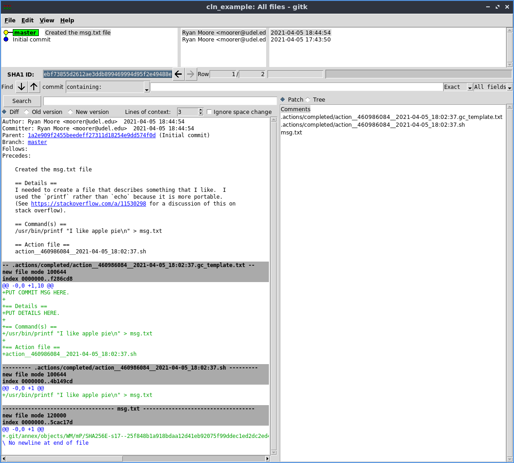

# Basic Usage Tutorial

(Note anything starting with a `$` means that is a command that you
have to run at the command prompt.  Anything below a command is the
output of that command.)

Let's walk through a simple example.  We won't do anything complicated
or interesting in this example, and we won't talk *too* much about
*why* you would want to use this in the first place.  It will be just
to show you how the mechanics of using the `cln` app might work.

*Note: to read a bit more about why you might want to use the `cln`
program, check out [this blog
post](https://www.tenderisthebyte.com/blog/2021/05/07/computational-lab-notebooks/).*

I'm going to assume that you already have `git`, `git-annex`, and
`cln` installed and ready to go.  If you don't, take a look at the
[install page](../installation.md).

## Set up your project

First thing to do is to set up a "project".  I'm going to be calling
it a project, but really it is just a directory with a git repository
where you are going to do some computational lab work that you need to
remeber the steps of things that you did.

So make a directory for our project and `cd` into that directory.

```
$ mkdir -p ~/projects/cln_example && cd ~/projects/cln_example
```

Next, we need to initialize the project.  Let's call it `Example
Project`.

```
$ cln init 'Example Project'
```

You should see some output showing some stuff about initializing an
empty git repository and an initial commit.  The `cln init` program is
simply a wrapper around setting up a `git` and `git-annex` repository
in this directory and then commiting in some of the folders and
boilerplate stuff that will be used for preparing and running jobs
later.

Let's see what was created.  (If you don't have the `tree` command,
you can install it like so `sudo apt-get install tree`).


```
$ tree -a -I .git
.
├── .actions
│   ├── completed
│   ├── failed
│   ├── ignored
│   └── pending
└── README.md
```

There is a `README.md` file with some basic info, and a couple of
folders for "actions".  Actions are what we call things that we want
to run and track in our lab notebook.  You can see directories for
pending, completed, failed, and ignored actions.  We will talk about
each of them later.

## Prepare a command

`cln prepare` is used to "prepare" commands that you want to run.  As
with all of this, you don't *need* to use the `cln` program--you could
just use git and git-annex directly--but going through the `cln`
program will help you set up things to make everything a little easier
to reproduce and track what is going on when you come back to your
project after a couple months of working on something else.

Let's set up a silly command that we want to run.  We are going to use
the `printf` command to write some text into a file.  If we were to
run it at the command prompt with out anything fancy it would look
something like this:

```
$ printf "I like apple pie\n" > msg.txt
```

And of course, you can check the output of that.

```
$ cat msg.txt
I like apple pie
```

Okay, let's delete that file for now since we don't need it.

```
$ rm msg.txt
```

Now, preparing a command is simple.  You just take whatever you were
going to run at the command prompt, put that in single quotes (if
you're command has single quotes, you will need to escape them), and
pass that as the first argument to the `cln prepare` command like
this:

```
$ cln prepare 'printf "I like apple pie\n" > msg.txt'
~~~
~~~
~~~ Hi!  I just prepared an action for you.
~~~
~~~ * The pending action is: '.actions/pending/action__460986084__2021-04-05_18:02:37.sh'
~~~ * The git commit template file is: '.actions/pending/action__460986084__2021-04-05_18:02:37.gc_template.txt'
~~~
~~~ Next, you should check the prepared action:
~~~   $ cln run -dry-run
~~~
~~~
```

You man see slightly different output than that, but the gist should
be the same.  As you can see, the `cln prepare` program created a
pending action and a git commit template.  (You'll see why the git
commit template is helpful in a bit.)  Let's take a look at those
files.

### Pending action file

```
$ cat '.actions/pending/action__460986084__2021-04-05_18:02:37.sh'
/usr/bin/printf "I like apple pie\n" > msg.txt
```

As you see, it is just a bash script with the comman you would have
run at the command prompt by hand, except with the command stuck into
a little script for easy reference later.  You'll see that the title
of the action file has some extra info, the date the action was
created and `460986084`, which is a hash of the contents.  The
contents hash can be helpful when you're scanning through action files
to see if you've run the same commands more than once.

### Git commit template

Now let's check out the git commit template file that was generated.

```
$ cat '.actions/pending/action__460986084__2021-04-05_18:02:37.gc_template.txt'
PUT COMMIT MSG HERE.

== Details ==
PUT DETAILS HERE.

== Command(s) ==
/usr/bin/printf "I like apple pie\n" > msg.txt

== Action file ==
action__460986084__2021-04-05_18:02:37.sh
```

You can see that is has some sections in there for commit summary,
details, the command that was/will be run, and the name of the action
file that had the command.  We will see how this helps us a bit later
in the tutorial.

## Running pending actions

Now that we have created a pending action, we want to run it.  To do
that, we use `cln run`.

### Preview the run

Before actually running the action, it is a good idea to preview it
first with the `-dry-run` option.

```
$ cln run -dry-run
~~~
~~~
~~~ Hi!  I just previewed an action for you.
~~~
~~~ I plan to run this action file:
~~~   '.actions/pending/action__460986084__2021-04-05_18:02:37.sh'
~~~
~~~ It's contents are:
~~~
/usr/bin/printf "I like apple pie\n" > msg.txt

~~~
~~~ If that looks good, you can run the action:
~~~   $ cln run
~~~
~~~
```

You should see output similar to the above.  It basically just shows
you the action that will be run, and the contents of the action file.

You may be wondering what happens if you have more than one pending
action.  Well, if you prepare actions through the `cln prepare`
interface, you are not allowed to prepare more than one action at a
time.  So it won't be a problem.  If you make an action file "by hand"
outside of the `cln prepare` interface, and then attempt to run `cln
run`, you will get an error about there being more than one action
pending.  At some point, I may add the ability to have multiple
pending actions, but for now, the program forces you to set up and run
one action at a time, so the accompanying git commits and their
messages will be clear and have a 1-to-1 relationship with the action
that was run (i.e., one action -> one commit).

Alright, that action looks correct to me, so let's run it!

### Actually running the action

To run the action, just drop the `-dry-run` option from the command
line.

```
$ cln run
~~~
~~~
~~~ Hi!  I just ran an action for you.
~~~
~~~ * The pending action was '.actions/pending/action__460986084__2021-04-05_18:02:37.sh'.
~~~ * The completed action is '.actions/completed/action__460986084__2021-04-05_18:02:37.sh'.
~~~
~~~ Now, there are a couple of things you should do.
~~~
~~~ * Check which files have changed:
~~~     $ git status
~~~ * Add actions and commit templates:
~~~     $ git add .actions
~~~ * Unless they are small, add other new files with git annex:
~~~     $ git annex add blah blah blah...
~~~ * After adding files, commit changes using the template:
~~~     $ git commit -t '.actions/completed/action__460986084__2021-04-05_18:02:37.gc_template.txt'
~~~
~~~ After that you are good to go!
~~~
~~~ * You can now check the logs with git log,
~~~   or use a GUI like gitk to view the history.
~~~
~~~
```

Alright our action was successfully ran!  There's a good amount of
output there, so let's go through it a little bit.

You will see the pending action that was run and the location
of the completed action file.  We keep all these action files so that,
in conjuction with the git logs, you can go back later and figure out
what was done.

Then, you should see some suggestions of what you may want to do next.

#### Checking git status

First you want to check the `git status` and see what effect running
the action has had on the state of your project.

```
$ git status
On branch master
Untracked files:
  (use "git add <file>..." to include in what will be committed)
	.actions/
	msg.txt

nothing added to commit but untracked files present (use "git add" to track)
```

(If you haven't used git before, you should probably check out a
[basic tutorial](../git.md) to get you up to speed.)

Basically that is saying that some new files were created in the
`.actions` directory and a new file called `msg.txt` was also created.
The stuff in the `.actions` directory were the action and git commit
template files, and the `msg.txt` file was what running the action
actually created.  Check it out.

```
$ cat msg.txt
I like apple pie
```

### Add .actions files to git repository

Next, we want to add the new template and action file to the git
repository.

We just use `git` for that.  This is the command to "add" all the
changes in the `.actions` directory to our git repository.

```
$ git add .actions
```

Now if you check the status, you will see that change reflected:

```
$ git status
On branch master
Changes to be committed:
  (use "git restore --staged <file>..." to unstage)
	new file:   .actions/completed/action__460986084__2021-04-05_18:02:37.gc_template.txt
	new file:   .actions/completed/action__460986084__2021-04-05_18:02:37.sh

Untracked files:
  (use "git add <file>..." to include in what will be committed)
	msg.txt
```

You see how those action and template files are now ready to be
commited but the `msg.txt` file is still "untracked"?

Note also that we are currently on the "master" branch, which is the
main branch in the repository.  This is mainly to keep things simple
in the tutorial, but for real work, you would probably want to
consider creating another branch to "do the work" in so that you can
easily roll things back if it all goes horribly wrong.

### Add other files with git-annex

Next, the output suggests that we add any other changed files into the
repository with `git-annex` unless they are small.  One problem with
using `git` for your lab notebook is that it really wasn't designed to
handle tracking giant files (like multi gb sequence files).  For this
reason, we want to use `git-annex` to track the large files.  For this
tutorial, the text file we created is really small, so we don't
actually need `git-annex` but I will show you how to do it anyways.
See the [more realistic examples](../todo.md) for more information
about why you probably want to use `git-annex`.

```
$ git annex add msg.txt
git annex add msg.txt
add msg.txt
ok
(recording state in git...)
```

Again, we will talk more about `git-annex` in another tutorial, but
basically you're now tracking the `msg.txt` file in your project
repository.  You can see for yourself with like this:

```
$ git status
On branch master
Changes to be committed:
  (use "git restore --staged <file>..." to unstage)
	new file:   .actions/completed/action__460986084__2021-04-05_18:02:37.gc_template.txt
	new file:   .actions/completed/action__460986084__2021-04-05_18:02:37.sh
	new file:   msg.txt
```

See now how all the files are in the "Changes to be commited" section?

### Commiting the changes

The last thing that the `cln run` output suggests that we do is to
actually commit the changes.  This will store whatever happened in the
project repository's history so we can track it later.  I will just
copy and paste the suggusted command from the `cln run` output into
the terminal and run it like so:

```
$ git commit -t '.actions/completed/action__460986084__2021-04-05_18:02:37.gc_template.txt'
```

Now you should see a text editor pop up with the following contents:

```
PUT COMMIT MSG HERE.

== Details ==
PUT DETAILS HERE.

== Command(s) ==
/usr/bin/printf "I like apple pie\n" > msg.txt

== Action file ==
action__460986084__2021-04-05_18:02:37.sh

# Please enter the commit message for your changes. Lines starting
# with '#' will be ignored, and an empty message aborts the commit.
#
# On branch master
# Changes to be committed:
#	new file:   .actions/completed/action__460986084__2021-04-05_18:02:37.gc_template.txt
#	new file:   .actions/completed/action__460986084__2021-04-05_18:02:37.sh
#	new file:   msg.txt
#
```

All you need to do now is to fill in a short summary message at the
top ([generally < 50 characters](https://commit.style/)) and then fill
in some details describing what you did and why you did it.  Don't
skimp on the details section.  Put any context you need and that you
would normally put in your lab notebook about what you did (e.g., any
weird command line options, why you used the program you used, why you
needed to run this command, etc.).  The summary and details will help
you out later so make take your time and make them good!  Here's an
example of what it might look like for our silly `printf` command.

```
Created the msg.txt file

== Details ==
I needed to create a file that describes something that I like.  I
used the `printf` rather than `echo` because it is more portable.
(See https://stackoverflow.com/a/11530298 for a discussion of this on
stack overflow).

== Command(s) ==
/usr/bin/printf "I like apple pie\n" > msg.txt

== Action file ==
action__460986084__2021-04-05_18:02:37.sh

# Please enter the commit message for your changes. Lines starting
# with '#' will be ignored, and an empty message aborts the commit.
#
# On branch master
# Changes to be committed:
#	new file:   .actions/completed/action__460986084__2021-04-05_18:02:37.gc_template.txt
#	new file:   .actions/completed/action__460986084__2021-04-05_18:02:37.sh
#	new file:   msg.txt
#
```

See how I added some details in there to help me remember why I did
what I did?  That's probably overkill for such a simple example, but
it will be very helpful when coming back to more complicated commands
in the future!

After you finish writing, save it and exit your editor to complete the
commit.  You will probably see some git specific output on your
terminal when you do.  Something like this:

```
[master ebf7385] Created the msg.txt file
 3 files changed, 12 insertions(+)
 create mode 100644 .actions/completed/action__460986084__2021-04-05_18:02:37.gc_template.txt
 create mode 100644 .actions/completed/action__460986084__2021-04-05_18:02:37.sh
 create mode 120000 msg.txt
```

Let's check the `git status` once more to make sure everything is okay.

```
$ git status
On branch master
nothing to commit, working tree clean
```

Alright, no problems!

## Reading the history

Now that we have prepared an action, run it, and commited the
resulting changes in to our project's repository, we can take a look
at the changes.

The simplest way to do this is with the `git log` command.

```
$ git log
commit ebf73855d2612ae3ddb899469994d95f2e49488e (HEAD -> master)
Author: Ryan Moore <moorer@udel.edu>
Date:   Mon Apr 5 18:44:54 2021 -0400

    Created the msg.txt file

    == Details ==
    I needed to create a file that describes something that I like.  I
    used the `printf` rather than `echo` because it is more portable.
    (See https://stackoverflow.com/a/11530298 for a discussion of this on
    stack overflow).

    == Command(s) ==
    /usr/bin/printf "I like apple pie\n" > msg.txt

    == Action file ==
    action__460986084__2021-04-05_18:02:37.sh

commit 1a2e909f2455beedeff27311d18254e9dd574f0d
Author: Ryan Moore <moorer@udel.edu>
Date:   Mon Apr 5 17:43:50 2021 -0400

    Initial commit
```

And you will see the last commit.

You can use a GUI like [gitk](https://git-scm.com/docs/gitk/) to get a
more interesting view of your commit history as well as a list of all
the files and changes that occured with each of the commits.

This is where it all gets really powerful.  You can browse the changes
in your repository one by one and see which actions were run to cause
all of those changes.



As you can see above, each commit is associated with the nice message
template you filled out, as well as showing you which files were
created and what changes occured in the repository.  Very nice!!

## Wrap up

That's *most* of what you need to know to get started with using `cln`
to help you manage your computation lab notebook with `git` and
`git-annex`.  There are some more things to show you about deleting
pending actions and using `git-annex` effectively, but that will be
covered in [other tutorials](../todo.md).
